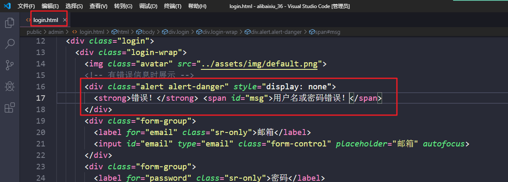

# 登录功能

在public/admin/login.html文件开始写代码



需要对表单数据进行验证  只有验证通过了 才发送ajax 

```html
 <!-- 引入jquery.min.js文件 -->
  <script src="../assets/vendors/jquery/jquery.min.js"></script>
  <script>
    $('button').on('click', function () {
      // 需要对表单数据进行验证  只有验证通过了 才发送ajax 
      var email = $('#email').val().trim().replace(/\s/g, '');
      var pwd = $('#password').val().trim().replace(/\s/g, '');

      // 先对邮件进行验证 
      var regEmail = /\w+[@]\w+[.]\w+/;

      if (!regEmail.test(email)) {
        // 提示
        $('.alert').fadeIn(1000).delay(1000).fadeOut(1000);
        $('#msg').text('邮件地址不合法，请重新填写');
        return;
      }

      var pwdEmail = /\w{4,20}/;

      if (!pwdEmail.test(pwd)) {
        // 提示
        $('.alert').fadeIn(1000).delay(1000).fadeOut(1000);
        $('#msg').text('密码不合法，请重新填写');
        return;
      }

      $.ajax({
        type: 'post',
        url: '/login',
        data: {
          email: email,
          password: pwd
        },
        success: function (res) {
          // 用户名和密码输入正确 跳转到网站后台首页
          location.href = "index.html";
        },
        error: function () {
          $('.alert').fadeIn(1000).delay(1000).fadeOut(1000);
          $('#msg').text('邮箱地址或者密码输入错误，请重新输入');
        }
      });
    });

  </script>
```

# 登录拦截

思路：

- 使用script标签加载服务器端提供的接口地址
- 判断isLogin变量的值，如果值为false，跳转到登录页面

```html
<script src="/login/status"></script>
<script>
  // console.log(isLogin);
  if (!isLogin) {
    location.href = "login.html";
  }
</script>
```


# 用户显示功能

打开 admin/users.html文件 

1.发送ajax请求

2.构建模板

3.渲染数据  

```html
<script src="../assets/vendors/art-template/template-web.js"></script>
  <!-- 用于显示用户列表的模板 -->
  <script type="text/html" id="userTpl">
    {{each list}}
    <tr>
        <td class="text-center"><input type="checkbox"></td>
        <td class="text-center"></td>
        <td>{{$value.email}}</td>
        <td>{{$value.nickName}}</td>
        <td>{{$value.status == 1 ? '激活' : '未激活'}}</td>
        <td>{{$value.role == 'admin' ? '管理员' : '普通用户'}}</td>
        <td class="text-center">
          <a href="javascript:;" class="btn btn-default btn-xs">编辑</a>
          <a href="javascript:;" class="btn btn-danger btn-xs">删除</a>
        </td>
      </tr>
      {{/each}}
  </script>
```

```html
 <script>
    // 定义一个数组 
    var userArr = [];
    // 发送ajax 
    $.ajax({
      type: 'get',
      url: '/users',
      success: function (res) {
        // 将res赋值给userArr
        userArr = res;
        render(userArr);
      }
    });


    // 定义render方法 用于渲染模块 
    function render(arr){
      var str = template('userTpl',{list:arr});
      $('tbody').html(str);
    }

  </script>
```

# 用户新增功能

1.普通数据

```javascript
   $('#addUser').on('click', function () {
      // 收集表单数据 
      let formData = $('form').serialize();
      // 调用ajax
      $.ajax({
        type: 'post',
        url: '/users',
        data: formData,
        success: function (res) {
          // 把res给push到userArr这个数组中 
          userArr.push(res);
          // 调用render()
          render(userArr);
        }
      });
    });
```

2.图片上传功能

```javascript
 $('#avatar').on('change', function () {
      // 创建FormData对象
      var formData = new FormData();
      formData.append('avatar', this.files[0]);
      // 发送ajax
      $.ajax({
        type: 'post',
        url: '/upload',
        data: formData,
        processData: false,
        contentType: false,
        success: function (res) {
          $('#img').val(res[0].avatar);
          $('#prev').attr('src', res[0].avatar);
        }
      })
    });
```

# 修改功能


# 删除用户功能

## 删除单个用户

1.给删除按钮注册点击事件  需要在模板中 给删除的a标签添加class属性 名为delete 

```html
 <script type="text/html" id="userTpl">
    {{each list}}
    <tr>
        <td class="text-center"><input type="checkbox"></td>
        <td class="text-center"></td>
        <td>{{$value.email}}</td>
        <td>{{$value.nickName}}</td>
        <td>{{$value.status == 1 ? '激活' : '未激活'}}</td>
        <td>{{$value.role == 'admin' ? '超级管理员' : '普通用户'}}</td>
        <td class="text-center" data-id="{{$value._id}}">
          <a href="javascript:;" class="btn btn-default btn-xs edit">编辑</a>
          <a href="javascript:;" class="btn btn-danger btn-xs delete">删除</a>
        </td>
      </tr>
      {{/each}}
  </script>
```

2.获取父元素身上的id属性

3.发送ajax实现删除功能  

4.只要删除功能 服务器会返回当前被删除的这个用户 返回是一个对象  然后根据这个对象去userArr数组中将对应的索引找到 然后调用 splice()方法 将数组元素删除  要调用render方法 重新渲染  

```javascript
 // 删除单个用户

    $('tbody').on('click', '.delete', function () {
      if (confirm("你真的要删除吗?")) {
        var id = $(this).parent().attr('data-id');

        // 发送ajax请求
        $.ajax({
          url: '/users/' + id,
          type: 'delete',
          success: function (res) {
            // 返回是一个对象  然后根据这个对象去userArr数组中将对应的索引找到 然后调用 splice()方法 将数组元素删除  要调用render方法 重新渲染  
            var index = userArr.findIndex(item => item._id == res._id);
            userArr.splice(index, 1);
            render(userArr);
          }
        });
      }
    });
```

## 删除多个用户

### 完成全选功能

```javascript
 $('thead input[type="checkbox"]').on('click', function () {
      var flag = $(this).prop('checked');
      // tbody里面的复选框的状态是由flag的值来决定的 
      $('tbody input[type="checkbox"]').prop('checked', flag);

      // 如果上面的复选框已经打上勾了 我们就让批量删除按钮显示 
      if (flag) {
        $('#allDel').show();
      } else {
        $('#allDel').hide();
      }
    });

    $('tbody').on('click', 'input[type="checkbox"]', function () {
      // 如果下面的复选框选中的个数 恰好等于 它身上的长度  表示下面所有的复选框都已经被选中了 
      var checkLength = $('tbody input[type="checkbox"]').length; //下面复选框的个数 
      var cLength = $('tbody input[type="checkbox"]:checked').length;

      if (checkLength == cLength) {
        $('thead input[type="checkbox"]').prop('checked', true);
      } else {
        $('thead input[type="checkbox"]').prop('checked', false);
      }

      // 如果下面复选框选中的个数大于1 我们就让批量删除按钮显示 
      if (cLength > 1) {
        $('#allDel').show();
      } else {
        $('#allDel').hide();
      }
    });
```


# 编辑文章功能

1. 给posts.html页面上面模板添加了a标签跳转地址

   ```html
   <script type="text/html" id="pTpl">
       {{each records}}
       <tr>
           <td>{{$value.title}}</td>
           <td>{{$value.author.nickName}}</td>
           <td>{{$value.category.title}}</td>
           <td class="text-center">{{$value.createAt && $value.createAt.substr(0,10)}}</td>
           <td class="text-center">{{$value.state == 1 ? '已发布' : '草稿'}}</td>
           <td class="text-center">
             <a href="post-add.html?id={{$value._id}}" class="btn btn-default btn-xs ">编辑</a>
             <a href="javascript:;" class="btn btn-danger btn-xs">删除</a>
           </td>
         </tr>
       {{/each}}
     
     </script>
   ```

   

2. 回到post-add.html  如果携带了?id参数 就表示是编辑文章功能  

3. 根据传递过来的id去请求服务器将这篇文章的所有数据查询到 

4. 将请求回来的数据填写到对应的输入框中 

   ```javascript
    if (id != -1) {
         // 编辑功能 根据传递过来的id去请求服务器将这篇文章的所有数据查询
         $.ajax({
           type: 'get',
           url: '/posts/' + id,
           success: function (res) {
             // console.log(res);
             $('#title').val(res.title);
             $('#content').val(res.content);
             $('h1').text('编辑文章');
             // 预览图片
             $('#prev').show().attr('src', res.thumbnail);
             $('#img').val(res.thumbnail);
   
             // 将对应的分类显示出来 
             $('#category > option').each((index, item) => {
               // 判断option里面的value属性的值与res.category的值是否相等 如果相等 就表示是这个分类 给其设置一个selected 
               if ($(item).attr('value') == res.category) {
                 $(item).prop('selected', true);
               }
             });
   
             $('#status > option').each((index, item) => {
               // 判断option里面的value属性的值与res.category的值是否相等 如果相等 就表示是这个分类 给其设置一个selected 
               if ($(item).attr('value') == res.state) {
                 $(item).prop('selected', true);
               }
             });
   
             $('#created').val(res.createAt.substr(0,16));
   
             // 将保存按钮隐藏 将编辑按钮显示出来 
             $('#pAdd').hide();
             $('#pEdit').show();
   
           }
         })
       }
   ```

   5. 给编辑按钮注册点击事件 发送ajax 完成对文章的编辑功能  当编辑完成以后 我们需要让页面跳转到posts.html页面

      ```javascript
       // 给编辑按钮注册点击事件 发送ajax 完成对文章的编辑功能  当编辑完成以后 我们需要让页面跳转到posts.html页面
          $('#pEdit').on('click',function(){
            $.ajax({
              type:'put',
              url:'/posts/' + id,
              data:$('form').serialize(),
              success:function(res){
                location.href = "posts.html";
              }
            });
          });
      ```

# 删除文章功能

1. 需要给模板设置class属性 值为delete  同时给其添加自定义属性 data-id

   ```html
   <script type="text/html" id="pTpl">
       {{each records}}
       <tr>
           <td>{{$value.title}}</td>
           <td>{{$value.author.nickName}}</td>
           <td>{{$value.category.title}}</td>
           <td class="text-center">{{$value.createAt && $value.createAt.substr(0,10)}}</td>
           <td class="text-center">{{$value.state == 1 ? '已发布' : '草稿'}}</td>
           <td class="text-center">
             <a href="post-add.html?id={{$value._id}}" class="btn btn-default btn-xs ">编辑</a>
             <a href="javascript:;" class="btn btn-danger btn-xs delete" data-id="{{$value._id}}">删除</a>
           </td>
         </tr>
       {{/each}}
     
     </script>
   ```

2. 给class值为delete的元素添加点击事件 

3. 当我们完成了删除功能时 应该让它显示在当前被删除的那个页面 

4. 如果我们当前页已经只有一条数据了 要回到上一页 

   ```javascript
    // 删除文章功能 
       $('tbody').on('click', '.delete', function () {
         if (confirm("你真的要甩了我吗?")) {
           var id = $(this).attr('data-id');
           $.ajax({
             type: 'delete',
             url: '/posts/' + id,
             success: function () {
               // console.log(currentPage);
               // 如果删除功能 我们需要调用render方法  
               if ($('tbody').children().length == 1) {
                 // 如果当前页已经是第一页  我们就让它在这一页 
                 if (currentPage == 1) {
                   render(s, c, currentPage);
                 } else {
                   render(s, c, currentPage - 1);
                 }
               } else {
                 render(s, c, currentPage);
               }
             }
           });
         }
       })
   ```

   